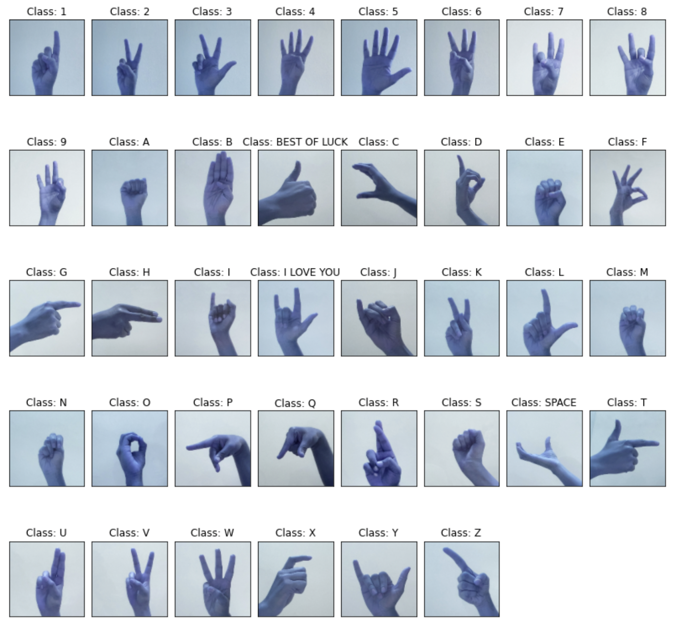

# Sign Language Recognition using Deep Learning
Communication is a very important part of our lives. Though most of our communications are through speech, some people are unable to do so due to not being able to speak or hear. Deafness may be caused by genetics, birth defects, ear infections, drug use, excessive noise exposure and aging. The deaf and mute community benefit greatly from the use of sign language. While sign language is vital to their ability to communicate with others and with themselves, it receives little attention from the general public. Ordinary people tend to overlook the relevance of sign language unless they are our close ones. Using the services of a sign language interpreter is one way for them but it can be expensive. An efficient and low cost solution is needed for these people to communicate normally.

There has been a lot of research to help this community in terms of translating the signs in the most efficient way through image recognition. The traditional pipeline of sign language recognition includes collection of image data or creation of the dataset, applying pre-processing techniques to images, feature extraction, training of the chosen model and classification of images by using Convolutional Neural Networks(CNNs).

In our project, we use multiple models including CNN, VGG16 and ResNet50 for efficient recognition of American sign language dataset using two existing Kaggle datasets(ASL Dataset and Sign Language MNIST dataset) as well as our custom dataset of 26 alphabets, 9 digits and 3 simple words. 

## Table of contents
* [Datasets](#dataset)
* [Technologies and Tools](#technologies-and-tools)
* [Demo](#setup)
* [Models](#features)
* [Screenshots](#screenshots)

## Dataset
1. Sign Language MNIST dataset - [Link](https://www.kaggle.com/datasets/datamunge/sign-language-mnist)
2. ASL Alphabet dataset - [Link](https://www.kaggle.com/datasets/grassknoted/asl-alphabet)
3. Custom dataset - [Link](https://www.kaggle.com/datasets/joannracheljacob/american-sign-language-dataset).

## Technologies and Tools
* Python 
* TensorFlow
* Keras
* OpenCV
* Pandas
* NumPy
* Fastai
* Matplotlib
* PIL

## Demo

data_collection.py is used to generate data for each class. This can be run using the command -  python data_collection.py 

Trained resnet50 model h5 file link - [Link](https://drive.google.com/file/d/1ZSEqRN4lgzfp_1_6nQ_4nlzq5rZ7DSeD/view?usp=sharing)

1. Load the demo.ipynb file into kaggle.
2. Download the h5 file from drive and add the h5 model on kaggle as a dataset into the input directory.
3. Add the dataset from kaggle itself by searching this link - [Link](https://www.kaggle.com/datasets/joannracheljacob/american-sign-language-dataset).
4. Run the code for prediction of one image using our final model.

## Models

* Simple CNN model using Sign Language MNIST dataset
* Simple CNN model using ASL Kaggle dataset
* VGG16 using ASL Kaggle dataset
* ResnNet50 using ASL Kaggle dataset
* ResNet50 using Custom ASL Dataset

## Screenshots

## Future Work

We have written a live_demo python script for live prediction using OpenCV which is yet to be loaded with the trained ResNet50 h5 file. This is still in works.
